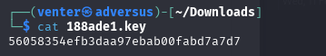

# THM-HAMMER
Web application security CTF from TryHackMe’s “Hammer.”
Demonstrating authentication bypass, session manipulation, JWT privilege escalation, and remote command execution 
*Slade Venter*

# TryHackMe – HAMMER
Author: Slade Venter

Category: Web Application Security / Authentication / JWT Tokens

# Scenario
The objective was to assess authentication controls, session behaviour, and privilege boundaries from an unauthenticated attacker perspective. The engagement was approached methodically, analysing password reset logic, token handling, and backend command execution mechanisms.

# Environment 
| Component | Details                                                                            |
| --------- | ---------------------------------------------------------------------------------- |
| Platform  | TryHackMe “Hammer” room                                                            |
| Tools     |Nmap, Feroxbuster, Burp Suite, JWT.io, Modified Python Script                       |
| Services  | SSH (22), PHP Web Server (1337)                                                    |
| Goal      | Identify authentication weaknesses and escalate privileges                         |

# Initial Reconnaissance
An Nmap scan revealed two open ports:
  -SSH on port [22]
  -PHP web server on port [1337]

  **nmap -sC -sV -p- <hammer.thm>**
   

# Directory Enumeration & Password Reset Analysis
Using Feroxbuster, directory enumeration was performed against the web server. Modified dirb wordlists were used. 

**feroxbuster -u http://hammer.thm:1337 -w /usr/share/wordlists/dirb/big.txt**

HMR confirmed in the page source

Some directories discovered are HMR directories these Hot Module Replacments are different to search for in the wordlists. This HMR discovery allows use to modifiy the dirb wordlist in a seperate directory to the scan spefically for HMR's. 

An error directory was discovered that showed evidence of previous password reset attempts. Under **tester@hammer.thm** This revealed the existence of a password recovery mechanism for the PHP.

Error Directory found

Error Logs in the directory

There are other directories to note from FO's output. Such as the adminphp page, but these are all smoke and mirrors.

# Exploiting the Password Reset Workflow

We are greeted with a loggin page, I tried to enter the obvious passwords and usernames but got nothing.

You can explore around and map the site. Eventually you'll come accross the PHPSESSID.
It all boils down to finding a way to bruteforce the password recovery. The mechanism works by first requesting a password reset and retreieving the PHPSESSID, then submit the recovery code in a brute-force manner while refeshing the PHPSESSID till you get the correct recovery code.

The password reset functionality relied on:
  -PHPSESSID
  -Recovery code
  -180-second validity window

Using Burp Suite, the reset link was intercepted and analysed. The recovery code validation logic could be brute forced while refreshing the PHPSESSID within the timeout window.

To acheieve our goals its time for some scripting.
A modified brute force script was used to automate the process.There are MANY scripts out there that can get the job done for this exact problem. 
I found a really good one authored By TheSysRAT. I then edited further for what I wanted to do added some other import sections and what it render. You can write you own if you would like but PLEASE at the very least understand what the script does. 

[View Script](BRUTETHIS.py)

Once run it produced a security code that was then used to gain access to the password reset function for *test@hammer.thm*

A reset password window will be displayed and feel free to use whatever password you want, but I suggest making it short 1234, qwerty etc. You will be typing it in a lot if you're exploring the page.

Go ahead and login and BOOM there is our first flag right on the top there.

# Command Transmission, AJAX & JWT

Its at this point where the app starts to log you out after a short time. Inspecting the page source reveals a couple of things here. 

The *persistentSession* parameter influenced session lifetime. Modifying the cookie expiry is the next step, we can set this using tools but I just continued the investigation using burpsuite after adjusting the cookies expiry in the browers tools. This is a lazy way to do things but it works and keeps us logged in.

A submitCommand function was identified which sent an AJAX request to the server containing user-supplied input. The request included a JWT token and resulted in backend command execution.
This behaviour represents command transmission, where client input is passed to the server and interpreted as system-level instructions. This is security sensitive because insufficient validation can allow attackers to execute arbitrary commands on the host.

That means we have possible RCE (Remote Code Execution)

After typing random commands and capturing them using burpsuite the "ls" command seems to be the only that brings up anything in the command box. It brings up some interesting directories, so now we have to try access them. So lets go ahead and capture that command being sent using BurpSuite and see what we have.

# JWT Analysis & Privilege Escalation

Keep that capture and send it to the repeater, going to use this later.

Heading to that directory leads you to .key file that can be downloaded, this file when read contains a secret key.
Please be cautious when downloading anything, even from THM.

We are going to assume that with the JWT token found in the source code AND a random key found that can only fit a handful of circumstances, we are going to have to manpiulate those JWT tokens.
Heading back to the BurpSuite capture of the "ls" command. I used jwt.io and supertokens to creat the tokens.

The JWT token when input into jwt.io shows the *kid* parameter referenced a local file path rather than a safe key identifier. This key indentifier is the key found earlier. Since this is a webapplication html will also have to be input into the token. 
I used supertokens to edit this part of token, adjusting the role to admin and the rest of the token with the key. I then used jwt.io to input the secret key [56058354efb3daa97ebab00fabd7a7d7] and validate the token.

The token was then added in the repeater in the *Authorization: Bearer* header and forward the token to the page.

# Remote Code Execution Confirmation

After confirming the code execution works, the flag was retreived with escalated privilges.
*cat /home/ubuntu/flag.txt*

Success! Thats Hammer done!

# Conclusion
The Hammer application demonstrates how multiple small trust issues can combine into full system compromise. The password reset process allowed repeated attempts within a limited window while the session identifier could be refreshed, turning a recovery feature into an authentication bypass. After login, session validity depended on client-side cookie state rather than server tracking, allowing the session to persist beyond its intended lifetime.
Further analysis revealed a command interface authorised by a JWT token whose kid header referenced a local file path. This exposed the signing secret, allowing a forged token with elevated privileges. The application accepted the modified token and executed supplied commands, resulting in remote code execution. The compromise occurred not through a software exploit but through misplaced trust in client controlled data across authentication, session management, and authorisation logic.

#Remediation
This section is dedicated helping people intrested in offensive security learn one step further that seems to be missed in alot of education and is so critical in landing good roles, remediation!

Password Reset Mechanism | High Risk (CVSS ~ 8.1)

The reset process should generate a long cryptographically secure token stored server side and linked to a single reset request. The server must track attempt counts and invalidate the token after a small number of failures or immediately after successful use. Reset attempts must not be reusable by refreshing a session, and the verification logic should not depend on timing windows alone. Rate limiting and per-account lockout should be enforced to prevent brute forcing.

Session Management | Medium Risk (CVSS ~ 6.5)

Session validity must be determined entirely by the server. Each session identifier should correspond to a server record containing creation time and expiry time. The server must reject expired sessions regardless of browser cookie lifetime. Client-side expiry should only affect browser behaviour and not authentication acceptance.

JWT Authorisation | Critical Risk (CVSS ~ 9.8)

The kid field should reference only keys from a predefined server keystore and never a file path. Signing secrets must not be retrievable through application functionality. The server should validate expected claims such as role and issuer and not trust any value simply because the token signature is valid.

Command Execution | Critical Risk (CVSS ~ 10.0)

Web requests should not directly execute system commands. Administrative actions should call controlled application functions, and user input must never be interpreted as operating system instructions. Restrict execution context and apply least privilege principles to prevent host compromise.

I try treat these types of rooms as client engagments rather then simple CTFs. I hope you enjoyed and I hope it helped you.
Make sure you look at your key file as time goes on THM will change the secrets file as tokens expire.
